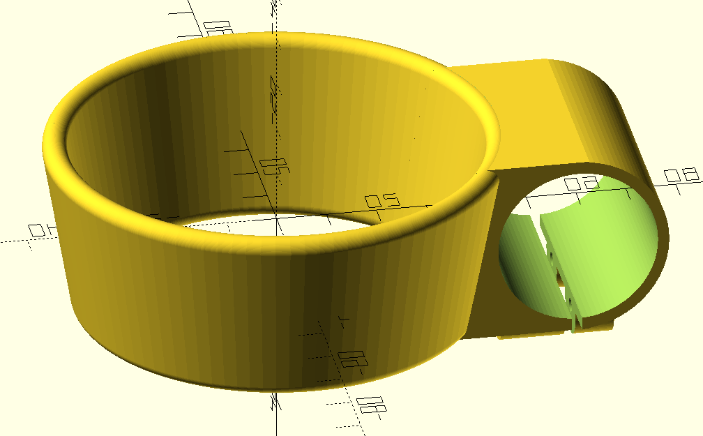
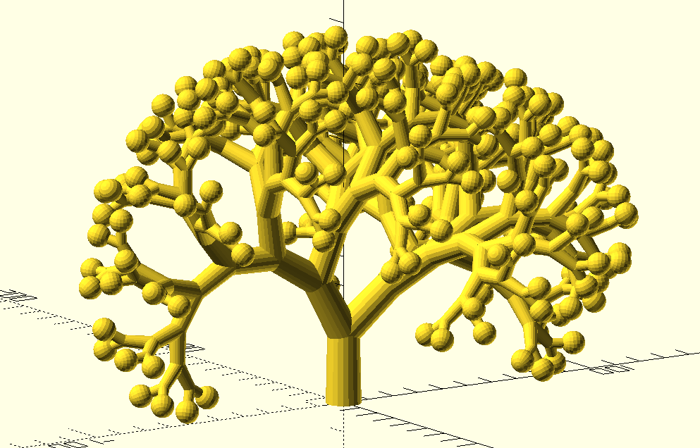
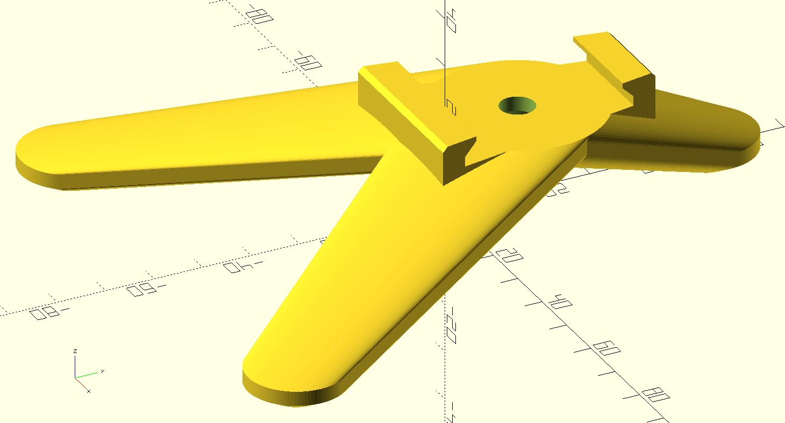

# models3d

Messing about with 3D models, mostly in OpenSCAD.

* alpha/: text based stuff, keyrings and tchotchkes.

* bikes/: bicycle / motorcycle / caravan parts
  

* forms/: interesting but useless shapes, including some experiments in recursion
  which take a *really* long time to compile to STL.
   

* parts/: printable 3D printer parts.
  * brace.scad: replacement for top corner of Prusa i3 to support remote hotend.
  * hotend-holder.scad: replacement for hotend holder.

* photo/: printable parts for photography.
  * tripod.scad: a flat slip-on tripod to steady the camera sitting on the ground.
    I call it a "penguin pod" because the camera looks like Pingu when it's on.
    

  * battery-box.scad: a parametric battery box, set up for three BLN-1 batteries
    but it's easy to change to other sizes or numbers.  Batteries just slip in and out
    which is fine for the camera bag pocket it lives in but the next iteration will
    have some kind of spring-loaded arrangement to retain batteries better.

* robot/: some parts for a robot project I'm working on on and off.

* tests/: test pieces to get fits right: blocks full of holes mostly.

See individual files for licenses.  If not otherwise noted, All Rights Reserved
but contact me if you have a purpose for them.
